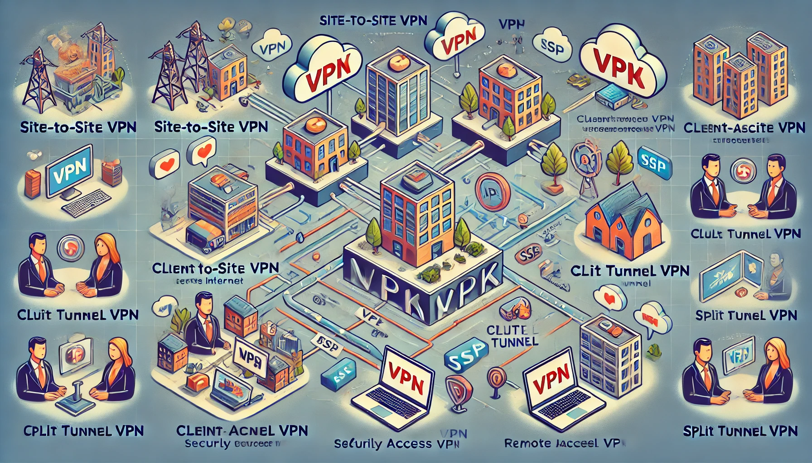

# Virtual Private Network (VPN) Overview

## 📌 What is a VPN?
A **VPN (Virtual Private Network)** is a technology that creates a secure and encrypted connection over the internet. It allows users to protect their online activities, bypass censorship, and securely access remote networks.

---

## 🔹 Common VPN Protocols
| **Protocol**  | **Encryption** | **Security** | **Speed** | **Usage** |
|--------------|--------------|------------|----------|--------|
| **PPTP** | MPPE (Weak) | Low | Fast | Legacy, not recommended |
| **L2TP/IPsec** | AES-256 | High | Moderate | Secure remote access |
| **IPsec** | AES-128/256 | Very High | Moderate | Site-to-site VPNs |
| **OpenVPN** | AES-256, Blowfish | High | Good | Flexible and secure |
| **WireGuard** | ChaCha20 | Very High | Fastest | Modern, lightweight VPN |

---

## 🔹 VPN Tunneling Protocols
VPN tunneling encapsulates data within another protocol to secure transmission over the internet.

| **Protocol**   | **Encapsulation** | **Security** | **Use Case** |
|--------------|----------------|------------|------------|
| PPTP        | GRE            | Weak | Legacy support |
| L2TP/IPsec  | IPsec ESP      | Strong | Secure remote access |
| OpenVPN     | SSL/TLS        | High | Works with firewalls |
| WireGuard   | UDP-based      | Very High | Lightweight and fast |

---

## 🔹 VPN Encryption Algorithms
Encryption ensures confidentiality and integrity of VPN connections.

| **Algorithm** | **Key Size** | **Security** | **Usage** |
|--------------|------------|------------|--------|
| AES-128/256  | 128 / 256-bit | Strong | Used in OpenVPN, IPsec |
| ChaCha20     | 256-bit | Very Strong | Used in WireGuard |
| 3DES         | 168-bit | Moderate | Deprecated |
| Blowfish     | 128-bit | Moderate | Older VPNs |

---

## 🔹 VPN Types
1. **Remote Access VPN**: Allows users to securely connect to a private network over the internet.
2. **Site-to-Site VPN**: Connects entire networks securely (e.g., branch offices to HQ).
3. **Clientless VPN**: Provides secure access through a web browser (SSL VPN).

