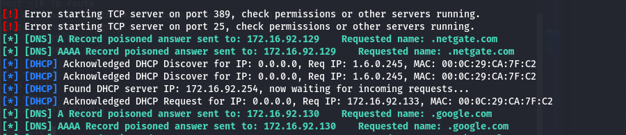

##  What is DHCP?

- **Stands for**: Dynamic Host Configuration Protocol  
- **Purpose**: Automatically assigns network configuration to clients on a network  
- **Network Configuration includes**:
  - IP address
  - Subnet mask
  - Default gateway
  - DNS server (optional)
- **Operates**: Over **UDP** using ports **67 (server)** and **68 (client)**
- **Layer**: Application layer (**Layer 7**) of the OSI model

---

##  DHCP Message Types:

| Message        | Description |
|----------------|-------------|
| **DHCPDISCOVER** | Sent by the client to locate available DHCP servers |
| **DHCPOFFER**    | Sent by the server in response, offering an IP and config |
| **DHCPREQUEST**  | Sent by the client to accept an offer or renew a lease |
| **DHCPACK**      | Final acknowledgment from server to client confirming the lease |
| **DHCPNAK**      | Sent by server to reject the request (e.g., invalid IP) |
| **DHCPDECLINE**  | Sent by client to inform server that offered IP is already in use |
| **DHCPRELEASE**  | Sent by client to release the IP address back to the server |
| **DHCPINFORM**   | Sent by client that already has an IP, requesting other config info |


---

## Identifying DHCP servers and configuration

- By using nmap 
   ```bash
      nmap --script broadcast-dhcp-discover <ip-address>
    ```
This result returned from my network home lab


---


#  Active DHCP Attacks

- In this attack, the attacker creates a **rogue DHCP server** to trick users into accepting malicious network configurations.

## If the attack is successful, the attacker can provide:
- IP address
- Rogue **gateway** →  Not very effective
- Rogue **DNS server** →  Very effective
- Rogue **WPAD** (Web Proxy Auto Discovery) → Very effective

---

##  Why rogue gateway is not effective?
> Because it causes a **half-duplex hijacking**, where the attacker can see outgoing packets from the victim, but **not** the responses from the legitimate gateway.

---

## Tools Used:
- **Responder**

---

## Table 5-7 — Responder DHCP Options

| Flag | Description |
|------|-------------|
| `-i` | Our IP address, advertised as a gateway |
| `-d` | The local DNS domain name (optional) |
| `-r` | IP address of the original router/gateway |
| `-p` | Primary DNS server IP address |
| `-s` | Secondary DNS server IP address (optional) |
| `-n` | The netmask of the local network |
| `-I` | The interface to listen for DHCP traffic on |
| `-w` | WPAD configuration address (URL) |
| `-S` | Spoof the default gateway IP address |
| `-R` | Respond to all DHCP requests (very noisy) |

---

##  Practical Example

On the attacker machine (Kali Linux), execute the following command:

```bash
sudo responder -d -w -i 172.16.92.1 -I vmnet1
```
options:

- -i: Attacker’s IP address (used in DHCP responses)

- -I: Network interface connected to the victim's network

-   -d: Enables DHCP spoofing mode

-    -w: Starts a rogue WPAD (Web Proxy Auto-Discovery) server

```For the attack to be effective in a real environment, the victim must reconnect to the network or restart their device to trigger a DHCP request.```

**In my lab, I simulated this by restarting the victim machine and observed the following:**



To confirm the success of the attack, I checked DNS settings on the victim:

Always show details

nslookup google.com


**This proves that the victim is using the attacker as DNS.**

---

## Impact of the Attack

- Steal HTTP credentials (via WPAD)

- Perform DNS spoofing → redirect to phishing pages

- Capture SMB requests (e.g., NTLM hashes via Responder)


## How to Prevent This Attack

- Enable DHCP Snooping on managed switches
 ```bash
# Cisco switch
ip dhcp snooping
ip dhcp snooping vlan 10
interface FastEthernet0/1
ip dhcp snooping trust
interface FastEthernet0/2
 ```
- Use VLAN segmentation to isolate critical devices

- Restrict DHCP responses to known trusted MAC addresses

- Use static IPs for critical infrastructure
    
