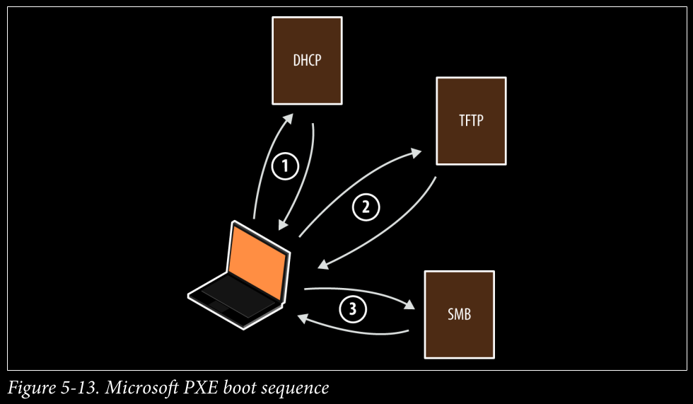

## What is PXE?

**PXE (Preboot Execution Environment)** 
- is a protocol that allows a computer to boot an operating system from a network server without needing a local hard disk or USB.  
- It relies on protocols such as **DHCP, TFTP, HTTP, or SMB** to fetch bootloaders and OS images.
- it's operates in one of two modes
   - lite touch : Requires credentials to load full OS images via SMB
   - zero touch : Loads a full OS without credentials

---

## How It Works

1. The client sends a **DHCPDISCOVER** request to obtain an IP address.
2. The DHCP server responds with an IP and the location of the PXE boot file (usually via TFTP).
3. The client downloads the bootloader (e.g., `pxelinux.0`) via **TFTP**.
4. The bootloader fetches the OS image using **HTTP**, **SMB**, or **NFS**.
5. The OS loads directly into memory or proceeds with installation.

> 

---

##  Security Warning

By default, many systems attempt PXE boot before checking the hard disk or USB.  
If an attacker controls a rogue PXE server on the same network, they can:
- Serve **malicious OS images**
- Trick users into unknowingly installing a backdoored system
- Gain **full access to the victim’s machine**

---

## PXE Attack Techniques

### 1. **Stealing Secrets from Legitimate OS Images**
- If the PXE server is misconfigured or exposed, attackers can download boot images and extract:
  - SSH keys  
  - Stored credentials  
  - Password hashes  

### 2. **Serving Malicious OS Images**
- A rogue PXE server can present a fake OS with:
  - Backdoors  
  - Keyloggers  
  - Fake login prompts to capture credentials  
  - BIOS/rootkit-level persistence

---

##  Recommendations

- Disable PXE boot unless needed.
- Enforce **full-disk encryption (FDE)** on endpoints.
- Use **signed boot images** and verify server identity.
- Restrict DHCP/TFTP traffic using VLAN segmentation and ACLs.
