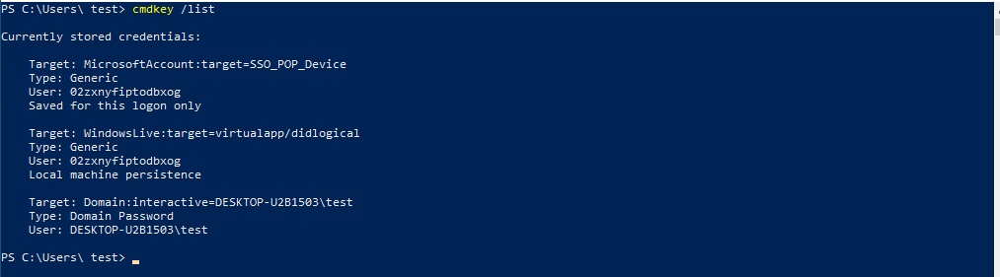
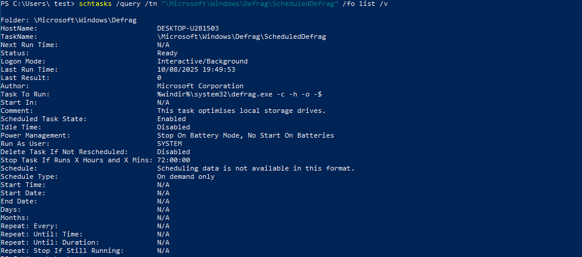

# Windows Privilege Escalation - Enumeration

1. **Harvesting Passwords from Usual Spots**  
- Unattended Windows installation  
 > Windows Deployment Service is used to distribute a Windows image between multiple users on a network.  

**This is usually saved with credentials in the following files:**  

- `C:\Unattend.xml`  
- `C:\Windows\Panther\Unattend.xml`  
- `C:\Windows\Panther\Unattend\Unattend.xml`  
- `C:\Windows\system32\sysprep.inf`  
- `C:\Windows\system32\sysprep\sysprep.xml`  

---

2. **PowerShell History**
```powershell
type $ENV:userprofile\AppData\Roaming\Microsoft\Windows\PowerShell\PSReadline\ConsoleHost_history.txt
```

3. **Saved Windows Credentials**
```powershell
cmdkey /list
```


4. **To list saved credentials that can be used later without a password**
```powershell
runas /savedcred /user:<username> cmd.exe
```
```This works only if the other user has entered their password at least once on the system.```

5. **IIS Configuration**  
- Default web server on Windows  
- Config file is found in **web.config**  
- It can store passwords for databases or authentication data  
- The password usually exists in:  
  - `C:\inetpub\wwwroot\web.config`  
  - `C:\Windows\Microsoft.NET\Framework64\v4.0.30319\Config\web.config`  

6. **Retrieve Credentials from Software: PuTTY**  
- It does not store passwords, but we can find session information such as:  
  - Proxy information that may include clear-text credentials  
    ```powershell
    reg query HKEY_CURRENT_USER\Software\SimonTatham\PuTTY\Sessions\ /f "Proxy" /s
    ```  
- **Retrieve credentials from the registry**  
  ```powershell
  reg query "HKLM\SOFTWARE\Microsoft\Windows NT\CurrentVersion\Winlogon"
  ```

7. **Scheduled Tasks Sometimes Can Have a File We Can Modify**
    ```powershell
        schtasks /query /tn <taskname> /fo list /v
    ```
**Example:**  
```powershell
schtasks /query /tn "\Microsoft\Windows\Defrag\ScheduledDefrag" /fo list /v
```


- **To display all tasks**
```powershell
schtasks
```